# System Architecture

## Complete System Diagram

```mermaid
flowchart TB
    subgraph User["👤 User"]
        prompt["Startup Problem"]
    end

    subgraph Frontend["🖥️ Frontend — Vite + React + Phaser"]
        ui["Pixel Office UI"]
        feed["ActivityFeed"]
        trust["TrustNetwork"]
        status["StatusBar"]
    end

    subgraph Backend["⚙️ Backend — FastAPI + WebSocket"]
        ws["WebSocket /ws"]
        rest["POST /debate"]

        subgraph Orchestrator["Orchestrator"]
            direction TB
            init["1. Memory Recall"]
            personas["2. Persona Factory"]
            prime["3. Primer"]
            loop["4. Debate Loop\n(2 rounds)"]
            summary["5. Summarise"]
            store["6. Store Memory"]
        end

        subgraph SystemServices["System Services"]
            mk["MemoryKeeper\n(ChromaDB)"]
            ta["TrustAnalyst\n(Trust Matrix)"]
            ra["ReflectionAgent\n(Org Health)"]
            rt["RoutingAgent\n(Turn Order)"]
            ts["ToolCallingService\n(MCP Tools)"]
        end

        subgraph ExecutiveAgents["11 Executive Agents"]
            ceo["CEO"]
            cto["CTO"]
            cfo["CFO"]
            cmo["CMO"]
            coo["COO"]
            inv["Investor"]
            leg["Legal"]
            ux["UX"]
            ma["MarketAnalyst"]
            cr["Critic"]
            ch["Chaos"]
        end

        subgraph DynamicAgents["3 Dynamic User Agents"]
            p1["Customer Persona 1"]
            p2["Customer Persona 2"]
            ip["Industry Partner"]
        end
    end

    subgraph DataStores["💾 Data Stores"]
        chroma["ChromaDB\n(Vector Memory)"]
    end

    subgraph Tools["🌐 MCP Tool Integrations"]
        ddg["DuckDuckGo\nweb_search"]
        news["NewsAPI.org\nnews_search"]
        fx["exchangerate-api.com\nfinancial_data"]
        reg["DuckDuckGo\nregulations_search"]
    end

    %% User → Backend
    prompt --> rest
    prompt --> ws

    %% Backend → Frontend (WebSocket Stream)
    ws --> ui
    ws --> feed
    ws --> trust
    ws --> status

    %% Orchestrator flow
    init --> personas --> prime --> loop --> summary --> store

    %% System Services → Orchestrator
    mk --> init
    ta --> loop
    ra --> loop
    rt --> loop
    ts --> loop

    %% Executive Agents speak in debate loop
    loop --> ceo
    loop --> cto
    loop --> cfo
    loop --> cmo
    loop --> coo
    loop --> inv
    loop --> leg
    loop --> ux
    loop --> ma
    loop --> cr
    loop --> ch

    %% Dynamic Agents speak in debate loop
    loop --> p1
    loop --> p2
    loop --> ip

    %% Persona Factory generates dynamic agents
    personas --> p1
    personas --> p2
    personas --> ip

    %% Primer injects context into all agents
    prime --> ExecutiveAgents
    prime --> DynamicAgents

    %% Memory Keeper ↔ ChromaDB
    mk <--> chroma

    %% Tool calls from specific agents
    ma -.->|"tool_call: web_search"| ddg
    inv -.->|"tool_call: web_search"| ddg
    cfo -.->|"tool_call: financial_data"| fx
    ch -.->|"tool_call: news_search"| news
    leg -.->|"tool_call: regulations_search"| reg

    %% Tool results flow back
    ddg -.->|"real-time data"| ma
    ddg -.->|"real-time data"| inv
    fx -.->|"real-time data"| cfo
    news -.->|"real-time data"| ch
    reg -.->|"real-time data"| leg

    %% WebSocket events
    ws -.->|"trust_update"| trust
    ws -.->|"agent_message"| feed
    ws -.->|"org_health_event"| feed
    ws -.->|"routing_update"| status
    ws -.->|"tool_call / tool_result"| feed
    ws -.->|"memory_recall / memory_stored"| ui
```

## Data Flow

1. **User** submits a startup problem via REST `POST /debate` or WebSocket `start_debate`
2. **Orchestrator** runs a 7-step debate pipeline:
   - Recalls past memories from ChromaDB
   - Generates 3 dynamic personas via Persona Factory
   - Primes all 15 agents with per-agent context
   - Runs 2 rounds of agent turns with dynamic routing
   - Summarises the debate via CEO agent
   - Stores compressed memory back to ChromaDB
3. **Every event** streams live over WebSocket to the React frontend
4. **5 agents** can call MCP tools for real-world data mid-debate

## Event Types (WebSocket Stream)

| Event | Emitter | Description |
|---|---|---|
| `primer_running` | Primer | Agents are reviewing the problem |
| `primer_complete` | Primer | All agents ready, debate starting |
| `memory_recall` | MemoryKeeper | Past memories retrieved |
| `persona_generated` | PersonaFactory | A dynamic user persona was created |
| `routing_update` | RoutingAgent | Turn order for the next round |
| `agent_token` | Orchestrator | Streaming token from speaking agent |
| `agent_message` | Orchestrator | Completed agent message |
| `tool_call` | ToolCallingService | Agent requested a tool call |
| `tool_result` | ToolCallingService | Tool returned data |
| `trust_update` | TrustAnalyst | Trust matrix changed |
| `org_health_event` | ReflectionAgent | Org health threshold triggered |
| `summary` | Orchestrator | Debate summary |
| `memory_stored` | MemoryKeeper | Memory persisted |
| `debate_complete` | Orchestrator | Final results with trust snapshot |
| `debate_error` | Orchestrator | Error with traceback |
